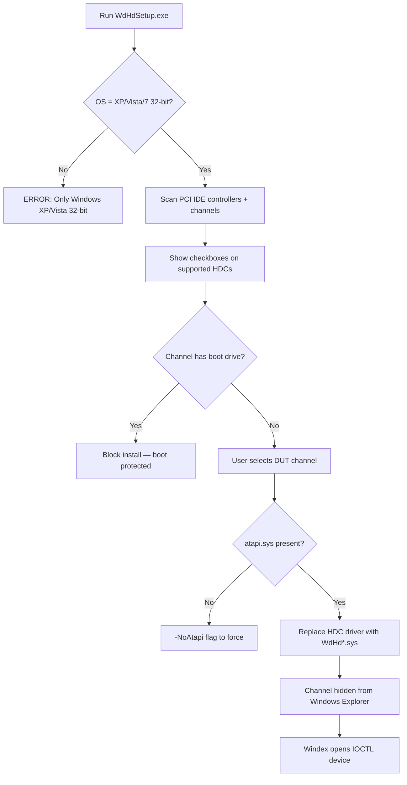

# Legacy WdHd 32-bit — ساختار نصب و معماری

Western Digital **WdHd PassThrough** (2005–2010) — مرجع برای Windex WD v3.

## ساختار پوشه نصب

```
driver/WdHdSetup/                    (در repo: test-windex/driver/WdHdSetup/)
├── WdHdSetup.exe          v1.13   GUI installer — Win XP/Vista/7 **32-bit only**
├── WdHdSetup.txt                  راهنمای نصب
├── WD Drive PassThrough Driver Installation.doc
├── Readme.txt
├── WdHddMsg.exe                   فیلتر پیام debug (WinDriveRouter)
├── Dbgview.exe                    Sysinternals
├── wdhdgen.inf / wdhdgen.sys      Generic IDE — v2.00 (Jun 2010)
├── wdhdpro.inf / wdhdpro.sys      Promise TX — v2.0
└── wdhdsi.inf  / wdhdsi.sys       Silicon Image 3124/3132 — v2.0
```

## جریان نصب (WdHdSetup.exe)



### نکات نصب

| قانون | توضیح |
|-------|--------|
| **هرگز روی دیسک بوت** | installer و driver هر دو boot channel را block می‌کنند |
| **BIOS = IDE/Compatible/Native** | AHCI/RAID در doc صریحاً **NOT supported** |
| **atapi.sys** | WdHdGen نیاز به Microsoft ATAPI روی HDC دارد (`-NoAtapi` override) |
| **پس از نصب** | کل channel از Windows مخفی — HDD + CD-ROM هر دو |

## سه variant درایور

| فایل | کنترلر | حالت دسترسی |
|------|--------|-------------|
| `wdhdgen.sys` | Intel ICH4–ICH10, JMicron, Marvell IDE, Primary/Secondary 0x1F0/0x170 | Legacy PIO task-file |
| `wdhdpro.sys` | Promise TX/FastTrak (VEN_105A) | Memory-mapped IDE |
| `wdhdsi.sys` | Silicon Image 3124/3132 (VEN_1095) | SI-specific |

کلاس PnP سفارشی: `WdcHdd` / GUID `{FF7E9C41-9555-4e2d-8E94-FCBF63CD0E23}`

## IOCTL API (از reverse engineering wdhdgen.sys v2.00)

| IOCTL | نقش |
|-------|-----|
| `IOCTL_WDHDD_INITIALIZE` | شروع session |
| `IOCTL_WDHDD_CLEANUP` | پایان session |
| `IOCTL_WDHDD_SCAN_DRIVES` | اسکن Master/Slave روی port |
| `IOCTL_WDHDD_GET_ADAPTER_INFO` | اطلاعات کنترلر PCI |
| `IOCTL_WDHDD_GET/SET_SETTINGS` | تنظیمات per-device |
| `IOCTL_WDHDD_GET_VERSION` | نسخه driver |
| `IOCTL_WDHDD_ATA_COMMAND` | ارسال ATA command |
| `IOCTL_WDHDD_PROTOCOL_COMMAND` | پروتکل چندمرحله‌ای ATA |
| `IOCTL_WDHDD_READ/WRITE_TASKFILE` | دسترسی مستقیم task-file registers |
| `IOCTL_WDHDD_READ/WRITE_PCICONFIG` | PCI config space |
| `IOCTL_WDHDD_SATA_COMMAND` | **WdHdGen: Unsupported** |
| `IOCTL_WDHDD_READ/WRITE_SATA_REGISTERS` | **WdHdGen: Unsupported** |

### قفل پورت (Port locking)

```
PortIsBusy(DeviceId)
PortSetBusy(DeviceId)
PortClearBusy(DeviceId)
IOCTL_WDHDD_SET_SETTINGS → eDLIB_PORT_BUSY
ATA/TaskFile ops → eDLIB_DRIVER_BUSY when port busy
```

## محدودیت‌های حیاتی برای Win10/11

| مورد | وضعیت |
|------|--------|
| معماری | **i386 only** — هیچ x64 build وجود ندارد |
| WdHdSetup.exe | `IsWow64Process` → روی 64-bit OS خطا |
| SATA مدرن | BIOS در حالت AHCI — driver کار نمی‌کند |
| NVMe | پشتیبانی ندارد |
| Secure Boot | امضای Microsoft ندارد — روی Win10/11 block می‌شود |
| WHQL | ندارد — Test Signing یا Disable Driver Signature Enforcement |

**نتیجه:** این پک فقط برای **لاب 32-bit Win7** با BIOS IDE mode قابل استفاده است — نه production روی PC مدرن.
