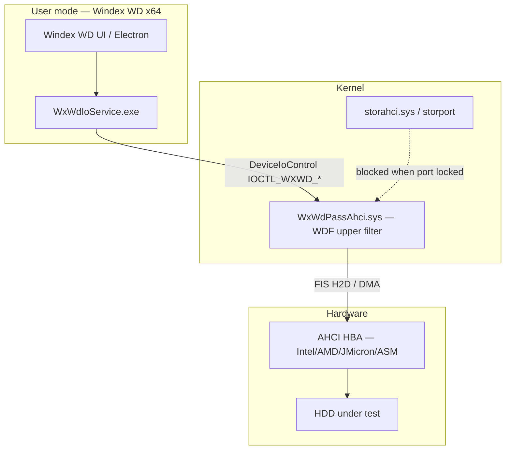
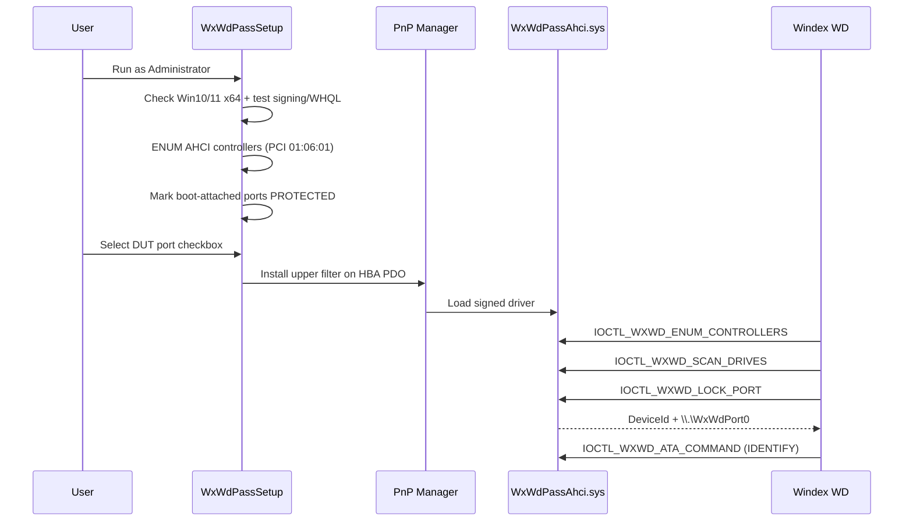

# WxWdPass v3.0 — مشخصات درایور AHCI/SATA برای Windex WD

**HamGap · Windex WD · Target: Windows 10/11 x64**

## هدف

جایگزین مدرن `WdHd*.sys` برای:

1. **تشخیص HDD** روی پورت SATA/AHCI
2. **قفل exclusive** پورت برای Windex WD (Windows دسترسی نداشته باشد)
3. **ATA + VSC** برای تعمیر factory (Identify, ROM, SA, tracks, ARCO/SF)
4. **Win10/11 x64** با Secure Boot (پس از WHQL یا EV cert)

## معماری پیشنهادی (۳ لایه)



### چرا WDF upper filter (نه replace کامل storahci مثل WdHd)?

| روش | مزیت | عیب |
|-----|------|-----|
| **Replace miniport** (WdHd قدیمی) | exclusive کامل | روی AHCI/Win10 شکننده، WHQL سخت |
| **Upper filter روی PDO** | سازگار با PnP مدرن | پیاده‌سازی پیچیده‌تر |
| **SCSI Pass-Through only** | بدون kernel driver | قفل واقعی پورت ندارد — Windows هنوز mount می‌کند |

**توصیه v3:** Upper filter + `IOCTL_STORAGE_SET_HOTPLUG_INFO` / offline volume + block IRP_MJ_READ/WRITE به PDO وقتی port locked.

### Fallback mode (فاز ۱ — بدون kernel signing)

برای توسعه سریع قبل از WHQL:

```
WxWdIoService.exe
  → CreateFile("\\.\PhysicalDriveN", exclusive)
  → IOCTL_DISK_OFFLINE
  → IOCTL_ATA_PASS_THROUGH_DIRECT (SAT-12)
```

| قابلیت | Fallback | Full WxWdPassAhci.sys |
|--------|----------|----------------------|
| Identify / VSC | ✅ | ✅ |
| قفل از Explorer | ⚠️ ناقص | ✅ |
| جلوگیری از mount خودکار | ⚠️ | ✅ |
| NCQ / multi-command | ❌ | ✅ |
| Secure Boot | ✅ (no driver) | نیاز به signed driver |

## ساختار نصب v3 (هدف)

```
driver/WxWdPass-v3/
├── docs/
│   ├── LEGACY-WDHDD-32BIT.md
│   └── WXWD-PASS-v3-SPEC.md          ← این فایل
├── include/
│   └── wxwd_ioctl.h                  ← IOCTL contract
├── install/
│   ├── WxWdPassSetup.exe             ← (build) GUI مثل WdHdSetup
│   ├── INSTALL-AHCI.bat
│   ├── UNINSTALL-AHCI.bat
│   ├── CHECK-DRIVER.bat
│   └── inf/
│       ├── wxwdahci.inf              ← AHCI class upper filter
│       └── wxwdahci.cat              ← WHQL catalog
├── src/                              ← (future WDK project)
│   ├── WxWdPassAhci/
│   └── WxWdIoService/
└── reference/
    └── pci-ahci-ids.txt
```

## جریان نصب v3 (WxWdPassSetup.exe)



## IOCTL v3 — خلاصه

مطابق `include/wxwd_ioctl.h`:

| IOCTL | نقش |
|-------|-----|
| `IOCTL_WXWD_ENUM_CONTROLLERS` | لیست HBA + PCI ID + boot flag |
| `IOCTL_WXWD_SCAN_DRIVES` | Identify per AHCI port |
| `IOCTL_WXWD_LOCK_PORT` | exclusive lock — hide from Windows |
| `IOCTL_WXWD_UNLOCK_PORT` | release |
| `IOCTL_WXWD_PORT_STATUS` | Free / Locked / Busy / BootProtected |
| `IOCTL_WXWD_ATA_COMMAND` | ATA 28/48 + data buffer |
| `IOCTL_WXWD_SATA_COMMAND` | FIS-based (NCQ optional) |
| `IOCTL_WXWD_READ/WRITE_SATA_REGISTERS` | PxCMD, PxTFD, PxSIG, … |
| `IOCTL_WXWD_VERIFY_LICENSE` | check قبل از I/O privileged |

Legacy shim: `IOCTL_WDHDD_*` → map به `IOCTL_WXWD_*` برای migration ابزارهای قدیمی.

## تشخیص HDD (Scan)

### AHCI port state machine

```
1. PxCMD.ST = 1 (start)
2. Wait PxTFD.BSY = 0
3. Issue IDENTIFY DEVICE (FIS Register H2D, command 0xEC)
4. DMA or PIO read 512 bytes → parse model/serial/fw
5. PxSIG: 0x00000101 = ATA device
```

### خروجی SCAN (سازگار با UI Windex WD)

```json
{
  "controllerIndex": 0,
  "portIndex": 2,
  "deviceId": 2,
  "present": true,
  "model": "WDC WD10JPVX-22JC3T0",
  "serial": "WX21A84K3821",
  "firmware": "01A01A01",
  "transport": "ahci",
  "hba": "Intel 300 Series SATA AHCI"
}
```

## قفل پورت (Lock)

مطابق رفتار WdHd + نیاز Windex:

| مرحله | عمل |
|-------|-----|
| 1 | `IOCTL_WXWD_LOCK_PORT` با `Flags bit0 = hide from Windows` |
| 2 | Filter: fail IRP_MJ_PNP start برای volume child |
| 3 | `PortSetBusy(deviceId)` — reject IOCTL از process دیگر |
| 4 | Notify mount manager — volume offline |
| 5 | Return symbolic link `\\.\WxWdPortN` به app |

Release: `IOCTL_WXWD_UNLOCK_PORT` → `PortClearBusy` → restore storahci path.

**Boot protection:** اگر `STORAGE_DEVICE_DESCRIPTOR` یا boot config نشان دهد OS روی همان HBA/port است → `WxWdErrBootChannel`.

## کنترلرهای پشتیبانی‌شده (فاز ۱)

از `reference/pci-ahci-ids.txt`:

| Vendor | Device examples | یادداشت |
|--------|-----------------|---------|
| Intel VEN_8086 | DEV_9C03, A102, A182, 7AE2, 8C02, 9C82 | اکثر PC/laptop |
| AMD VEN_1022 | DEV_7901, 7904, 43EB, 43F6 | Ryzen chipsets |
| ASMedia VEN_1B21 | DEV_0612, 1166 | add-in SATA USB3 cards |
| JMicron VEN_197B | DEV_0585, 236F | cheap SATA cards |
| Marvell VEN_1B4B | DEV_9215, 9172 | some NAS/HBA |

**فاز ۲:** NVMe pass-through جدا (`WxWdPassNvme.sys`) — خارج از scope v3.0.

## License gate در driver

قبل از `LOCK_PORT` و `ATA_COMMAND`:

```
IOCTL_WXWD_VERIFY_LICENSE
  → Ed25519 verify license blob
  → machine fingerprint match
  → expiry check
  → WxWdErrLicense on fail
```

UI-only check کافی نیست — همانند `LICENSE-SYSTEM.md`.

## Roadmap پیاده‌سازی

| فاز | تحویل | زمان فنی |
|-----|--------|----------|
| **0** | این spec + `wxwd_ioctl.h` + CHECK bat | ✅ now |
| **1** | `WxWdIoService` fallback (PhysicalDrive + ATA PT) | 1 WDK sprint |
| **2** | `WxWdPassAhci.sys` filter — lock + scan | 2–3 sprints |
| **3** | `WxWdPassSetup.exe` GUI + WHQL submission | + cert cost |
| **4** | Wire Windex WD UI → real IOCTL | app integration |

## تست پذیرش (Acceptance)

1. Win11 x64, BIOS AHCI, DUT روی پورت غیر-OS
2. `CHECK-DRIVER.bat` → `[OK] WxWdPassAhci.sys loaded`
3. Windex WD → Detect → port listed with model/serial
4. Lock port → drive ناپدید از Disk Management
5. Identify + Read ROM module 0x4F (VSC)
6. Unlock → drive دوباره در Windows دیده شود
7. Boot port → install/lock blocked

## مقایسه نسخه‌ها

| | WdHd 2.x (legacy) | WxWdPass 3.0 |
|--|-------------------|--------------|
| OS | Win7 32-bit | Win10/11 x64 |
| BIOS | IDE/Compatible | **AHCI** |
| Transport | PIO 0x1F0 | AHCI FIS + DMA |
| SATA NCQ | No (Gen) | Optional |
| NVMe | No | Phase 2 |
| Signing | None | EV + WHQL target |
| Installer | WdHdSetup 1.13 | WxWdPassSetup 1.0 |
| IOCTL | IOCTL_WDHDD_* | IOCTL_WXWD_* + shim |
